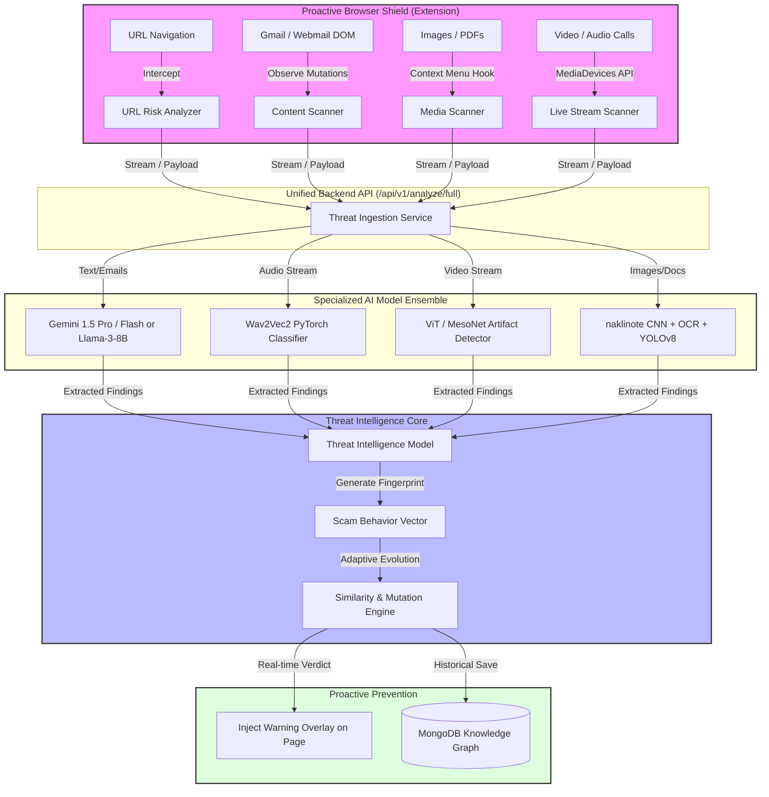

# SentinelAI: A Proactive, Multi-Modal Digital Public Safety Framework
**🌐:** https://sentinelai-rm0s.onrender.com
> **Economic Times AI Hackathon 2026 — Research Project & Framework Blueprint**
> An AI-powered Proactive Digital Public Safety Framework designed to automatically detect, analyze, predict, and prevent digital fraud *before* citizens become victims.

---

## 🌟 Abstract & Vision

SentinelAI is transitioning from a reactive analysis tool into an **Adaptive Proactive Framework** engineered to protect citizens by analyzing multi-modal cyber threat vectors in real-time (Emails, URL phishing sites, PDFs, audio/video streams, and images). 

This research project aims to establish a seamless, zero-friction layer of security. By operating primarily through a transparent browser extension and a unified API backend, SentinelAI monitors DOM changes (such as Gmail screens), web navigations, and media streams to warn users of impending threats like Digital Arrest scams, KYC fraud, and Deepfake voice clones without requiring manual copy-pasting.

---

## 🏗️ Unified High-Level System Architecture

The following diagram illustrates how the proactive framework intercepts data across multiple modalities, passing it into a unified intelligence core before fraud is committed.

---

## 🔬 AI Model Ensemble (Research Methodology)

SentinelAI leverages a hybrid ensemble of API-based and local deep learning models to process different vectors of attack efficiently:

1. **Text & Behavioral Analysis (Emails, SMS, Websites)**
   - **Models**: Google Gemini 1.5 Pro/Flash (Primary), Llama-3-8B-Instruct (Fallback).
   - **Application**: Extracts entities, maps psychological tactics (e.g., Authority, Fear), and builds structured behavior profiles (Digital Arrest, Investment Fraud) directly from scraped DOM text.
2. **Audio Deepfake & Voice Cloning Detection**
   - **Models**: Wav2Vec2-Large-XLS-R (PyTorch) fine-tuned on synthetic speech datasets (ASVspoof).
   - **Application**: Analyzes acoustic features (MFCCs, spectral roll-off) of incoming audio streams during calls to detect voice cloning signatures.
3. **Video Deepfake & Face Morphing Detection**
   - **Models**: Vision Transformer (ViT) or XceptionNet.
   - **Application**: Frame-by-frame analysis of video calls to detect blending artifacts, unnatural eye movements, or generative AI signatures.
4. **Image Forgery & Counterfeit Detection**
   - **Models**: Custom Keras CNN (`naklinote.keras`) + PyTesseract OCR.
   - **Application**: Scans uploaded/intercepted images for manipulated bank receipts, fake advisories, or counterfeit currency notes.

---

## 🔄 In-Depth System Working Flow (Digital Safety Framework)

As a complete digital safety framework, SentinelAI acts as a 24/7 background bodyguard. It operates in five clear steps—from detecting suspicious activities to stopping frauds like deepfake calls, counterfeit documents, and phishing links before they happen.

### Phase 1: Proactive Data Collection (Watching for Danger)
1. **Screen & Email Scanning:** The browser extension silently watches platforms like Gmail and banking sites. It instantly detects suspicious text (e.g., fake "Urgent KYC" emails or Digital Arrest threats) without the user needing to manually copy and paste anything.
2. **Link & Phishing Interception:** Whenever a link is clicked, the system checks the destination in the background. It catches fake phishing websites (zero-day threats) before they even fully load.
3. **Live Audio/Video & Image Scanning:** During video/audio calls, or when an image is viewed, the system samples small media chunks securely. This is crucial for catching live voice cloning or counterfeit documents in real-time.

### Phase 2: Secure Data Handling
1. **Smart Packaging:** The gathered information (a link, email text, a picture, or a voice clip) is packaged with context (when and where it was found).
2. **Privacy-First Transfer:** The data is sent securely to our Unified Backend API. The system ensures user privacy by never permanently storing personal data (PII).

### Phase 3: AI Intelligence Core (Analyzing the Threat)
Once the data reaches the backend, our specialized AI models analyze it in plain sight:
1. **Text Analysis (Catching Scams):** Smart language models (like Google Gemini) read texts and emails to detect psychological manipulation. They look for words causing fear or urgency, easily identifying scams like Digital Arrests or fake investments.
2. **Voice & Audio Check (Stopping Deepfakes):** Audio AI analyzes the sound waves of voice calls to detect artificial robotic tones or cloned voices, protecting against family-emergency voice scams.
3. **Visual & Counterfeit Forensics:** Image-processing AI scans documents and videos. It easily spots if a bank receipt has been edited, if a currency note is a counterfeit, or if a video caller's face is a generated deepfake.

### Phase 4: Final Decision Making
1. **Combining Evidence:** The Threat Intelligence Model looks at all the clues together (e.g., bad text + fake audio = high danger).
2. **Scam Fingerprinting:** It creates a "Scam Profile" and compares it to our database of known frauds (our Knowledge Graph).
3. **Scoring the Danger:** A final "threat score" is calculated. If the score is too high, the system declares it an active cyber attack.

### Phase 5: Action & Prevention (Stopping the Attack)
1. **Instant Blocking:** The backend immediately alerts the browser extension.
2. **On-Screen Warnings:** The extension throws a massive, unmissable red warning directly on your screen (like a banner inside your email or a block-page on a dangerous website), stopping you from losing money or data.
3. **Getting Smarter:** The anonymous details of this new attack are saved in our database. The AI learns from this, becoming even faster at stopping similar future attacks.

---

## 🛡️ The Proactive Shield (Browser Extension)

To remove friction and prevent attacks *before* they succeed, SentinelAI includes a highly privileged Manifest V3 extension.
- **Gmail & Webmail DOM Scanning**: Injects content scripts that silently read the email body and sender on `mail.google.com`. If an email exhibits scam behavior (e.g., "Urgent KYC Update"), the extension injects a red warning banner natively into the Gmail interface.
- **Zero-Click URL Protection**: Automatically analyzes URLs in the background during navigation. If the destination domain is scored as high-risk, a blocking modal is displayed.
- **Context Menu Integration**: Right-click on images, highlighted text, or links to invoke "Analyze with SentinelAI" instantly.
- **Privacy by Design**: (Research Scope) Audio/Video WebRTC streams are processed either locally in the browser (via ONNX runtime) or streamed securely to the backend without persisting raw PII data, ensuring compliance with privacy standards.

---

## 🚀 Installation & Local Execution Guide

### Prerequisites
*   **Python 3.10+** (Python 3.11/3.12 recommended)
*   **Node.js 18+** & npm
*   **MongoDB** (Local instance or Atlas connection string)
*   **Tesseract OCR Engine** (Added to system PATH)

### Step 1: Backend Setup
1.  Navigate into the `backend/` folder: `cd backend`
2.  Create virtual environment: `python -m venv venv` and activate it.
3.  Install dependencies: `pip install -r requirements.txt`
4.  Copy `.env.example` to `.env` and set `MONGO_URI`, `MONGO_DB`, and `GEMINI_API_KEY`.
5.  Start FastAPI: `python main.py`

### Step 2: Frontend Setup
1.  Navigate into the `frontend-react/` folder: `cd frontend-react`
2.  Install packages: `npm install`
3.  Run Vite development server: `npm run dev`

### Step 3: Install Proactive Extension
1. Open `chrome://extensions/` in Chrome/Brave.
2. Toggle **Developer mode** ON.
3. Click **Load unpacked** and select the `extension/` directory.
4. Open Gmail or navigate to a test phishing site to see the proactive alerts in action.

---
> **Disclaimer for Research Publication**: This system handles active DOM scanning and media interception. In production, explicit user consent must be captured for screen and audio stream interception in accordance with privacy laws.
