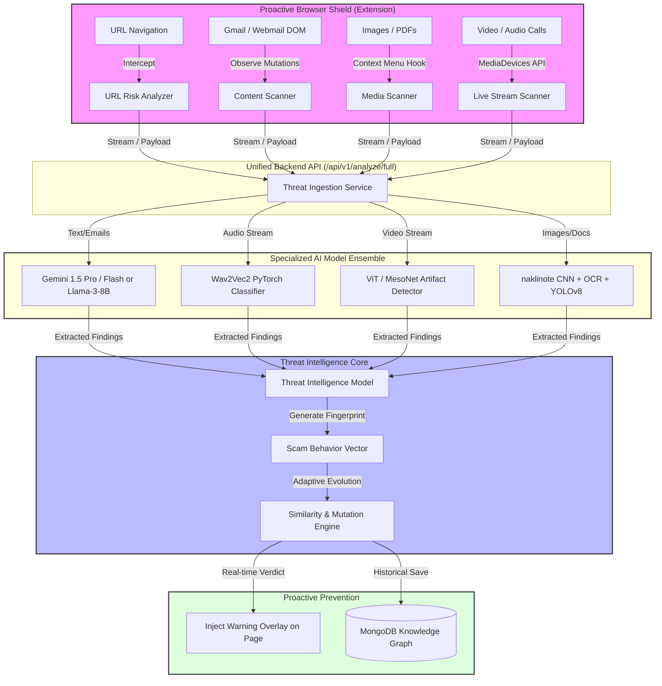

# SentinelAI: A Proactive, Multi-Modal Digital Public Safety Framework
**🌐:** https://sentinelai-rm0s.onrender.com
> **Economic Times AI Hackathon 2026 — Research Project & Framework Blueprint**
> An AI-powered Proactive Digital Public Safety Framework designed to automatically detect, analyze, predict, and prevent digital fraud *before* citizens become victims.

---

## 🌟 Abstract & Vision

SentinelAI is transitioning from a reactive analysis tool into an **Adaptive Proactive Framework** engineered to protect citizens by analyzing multi-modal cyber threat vectors in real-time (Emails, URL phishing sites, PDFs, audio/video streams, and images). 

This research project aims to establish a seamless, zero-friction layer of security. By operating primarily through a transparent browser extension and a unified API backend, SentinelAI monitors DOM changes (such as Gmail screens), web navigations, and media streams to warn users of impending threats like Digital Arrest scams, KYC fraud, and Deepfake voice clones without requiring manual copy-pasting.

---

## 🏗️ Unified High-Level System Architecture

The following diagram illustrates how the proactive framework intercepts data across multiple modalities, passing it into a unified intelligence core before fraud is committed.

---

## 🔬 AI Model Ensemble (Research Methodology)

SentinelAI leverages a hybrid ensemble of API-based and local deep learning models to process different vectors of attack efficiently:

1. **Text & Behavioral Analysis (Emails, SMS, Websites)**
   - **Models**: Google Gemini 1.5 Pro/Flash (Primary), Llama-3-8B-Instruct (Fallback).
   - **Application**: Extracts entities, maps psychological tactics (e.g., Authority, Fear), and builds structured behavior profiles (Digital Arrest, Investment Fraud) directly from scraped DOM text.
2. **Audio Deepfake & Voice Cloning Detection**
   - **Models**: Wav2Vec2-Large-XLS-R (PyTorch) fine-tuned on synthetic speech datasets (ASVspoof).
   - **Application**: Analyzes acoustic features (MFCCs, spectral roll-off) of incoming audio streams during calls to detect voice cloning signatures.
3. **Video Deepfake & Face Morphing Detection**
   - **Models**: Vision Transformer (ViT) or XceptionNet.
   - **Application**: Frame-by-frame analysis of video calls to detect blending artifacts, unnatural eye movements, or generative AI signatures.
4. **Image Forgery & Counterfeit Detection**
   - **Models**: Custom Keras CNN (`naklinote.keras`) + PyTesseract OCR.
   - **Application**: Scans uploaded/intercepted images for manipulated bank receipts, fake advisories, or counterfeit currency notes.

---

## 🔄 In-Depth System Working Flow (Digital Safety Framework)

As a comprehensive digital safety framework, SentinelAI operates on a multi-stage, closed-loop workflow that functions seamlessly in the background. Below is the rigorous step-by-step execution flow of our research framework, designed to move from passive detection to active threat mitigation.

### Phase 1: Proactive Interception & Data Acquisition
1. **DOM Mutation Observation:** The browser extension continuously monitors for DOM changes on sensitive platforms (e.g., Gmail, web banking portals). It hooks into relevant elements to capture emerging textual threats in real-time.
2. **Zero-Click Navigation Analysis:** Background scripts intercept all outbound URL navigations. Before a page fully renders, the URL is captured for zero-day threat analysis.
3. **Multi-Modal Stream Hooking:** For live communications, the framework securely hooks into the `MediaDevices` API, sampling audio and video chunks locally without disrupting the user's communication flow.

### Phase 2: Secure Payload Orchestration
1. **Contextual Packaging:** Intercepted data (URLs, email DOM text, media blobs) is packaged with contextual metadata (source, timestamp, interaction type).
2. **Encrypted Ingestion:** Payloads are securely transmitted to the Unified Backend API (`/api/v1/analyze/full`) via TLS, strictly adhering to privacy-by-design principles (avoiding PII persistence where possible).

### Phase 3: AI Ensemble Processing (The Intelligence Core)
Once data reaches the backend, it is routed to specialized AI models based on its modality:
1. **Text/Heuristic Pipeline:** Extracted text is fed into LLMs (Gemini 1.5 Pro / Llama-3) to perform semantic and psychological analysis. The model evaluates social engineering triggers (urgency, fear, authority) and maps them to known scam typologies (e.g., Digital Arrest, Fake KYC).
2. **Acoustic/Voice Analysis:** Audio streams are processed by Wav2Vec2 models to map acoustic features and detect deepfake synthetic voice anomalies, preventing voice cloning scams.
3. **Visual/Media Forensics:** Videos and images pass through CNNs and Vision Transformers (ViT) to identify facial morphing artifacts, generative AI blending issues, or counterfeit document manipulation.

### Phase 4: Threat Synthesis & Verdict Generation
1. **Multi-Vector Aggregation:** The Threat Intelligence Model aggregates the outputs from the independent AI classifiers.
2. **Behavioral Fingerprinting:** The system generates a "Scam Behavior Vector"—a mathematical representation of the attack—and compares it against the historical Knowledge Graph using similarity engines.
3. **Verdict Calculation:** A final confidence score is generated. If the score surpasses the critical threshold, the threat is flagged as active.

### Phase 5: Proactive Prevention & Feedback Loop
1. **Real-Time Intervention:** The backend instantly sends a blocking signal to the browser extension.
2. **UI Injection:** The extension injects high-visibility warning overlays directly into the DOM (e.g., a red banner natively injected into Gmail, or a full-page blocking modal for malicious URLs), halting the user before they can interact with the threat.
3. **Knowledge Graph Evolution:** Anonymized threat vectors are stored in the MongoDB Knowledge Graph, allowing the framework to self-adapt and mutate its defensive strategies against future zero-day attacks.

---

## 🛡️ The Proactive Shield (Browser Extension)

To remove friction and prevent attacks *before* they succeed, SentinelAI includes a highly privileged Manifest V3 extension.
- **Gmail & Webmail DOM Scanning**: Injects content scripts that silently read the email body and sender on `mail.google.com`. If an email exhibits scam behavior (e.g., "Urgent KYC Update"), the extension injects a red warning banner natively into the Gmail interface.
- **Zero-Click URL Protection**: Automatically analyzes URLs in the background during navigation. If the destination domain is scored as high-risk, a blocking modal is displayed.
- **Context Menu Integration**: Right-click on images, highlighted text, or links to invoke "Analyze with SentinelAI" instantly.
- **Privacy by Design**: (Research Scope) Audio/Video WebRTC streams are processed either locally in the browser (via ONNX runtime) or streamed securely to the backend without persisting raw PII data, ensuring compliance with privacy standards.

---

## 🚀 Installation & Local Execution Guide

### Prerequisites
*   **Python 3.10+** (Python 3.11/3.12 recommended)
*   **Node.js 18+** & npm
*   **MongoDB** (Local instance or Atlas connection string)
*   **Tesseract OCR Engine** (Added to system PATH)

### Step 1: Backend Setup
1.  Navigate into the `backend/` folder: `cd backend`
2.  Create virtual environment: `python -m venv venv` and activate it.
3.  Install dependencies: `pip install -r requirements.txt`
4.  Copy `.env.example` to `.env` and set `MONGO_URI`, `MONGO_DB`, and `GEMINI_API_KEY`.
5.  Start FastAPI: `python main.py`

### Step 2: Frontend Setup
1.  Navigate into the `frontend-react/` folder: `cd frontend-react`
2.  Install packages: `npm install`
3.  Run Vite development server: `npm run dev`

### Step 3: Install Proactive Extension
1. Open `chrome://extensions/` in Chrome/Brave.
2. Toggle **Developer mode** ON.
3. Click **Load unpacked** and select the `extension/` directory.
4. Open Gmail or navigate to a test phishing site to see the proactive alerts in action.

---
> **Disclaimer for Research Publication**: This system handles active DOM scanning and media interception. In production, explicit user consent must be captured for screen and audio stream interception in accordance with privacy laws.
